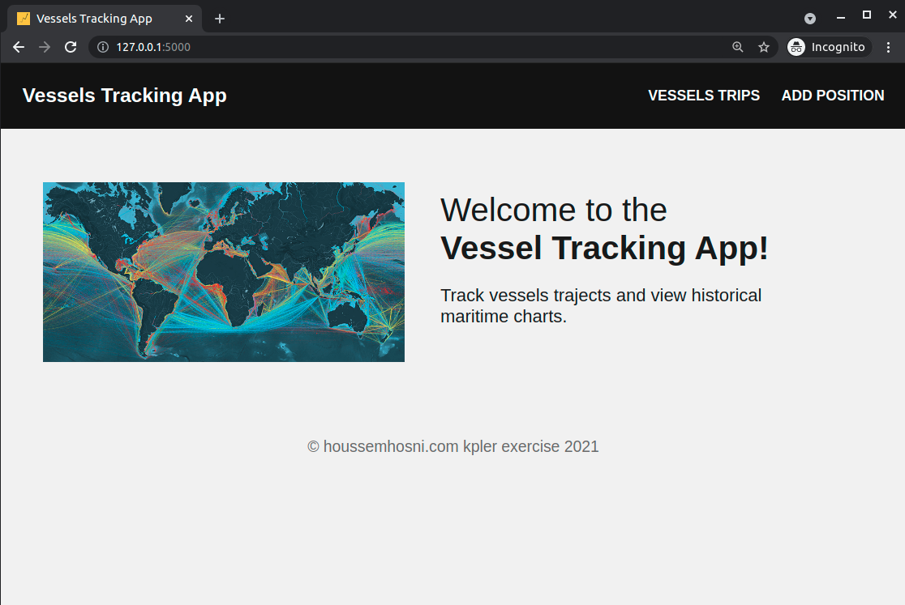
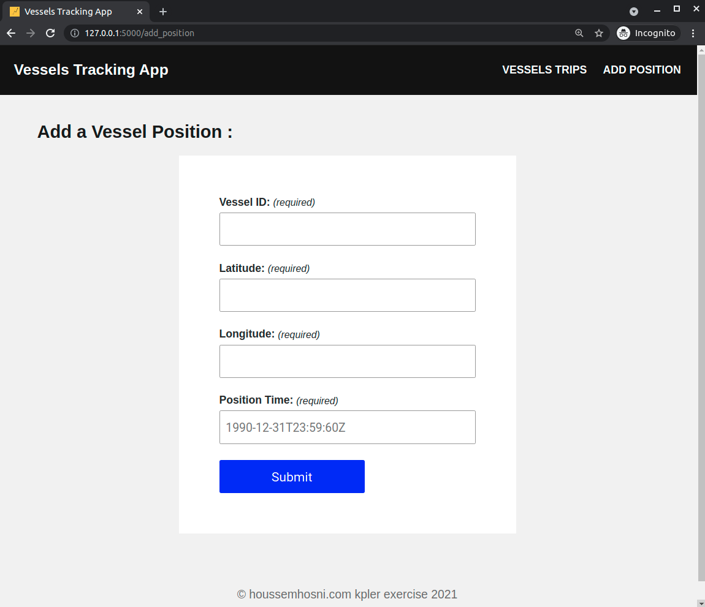
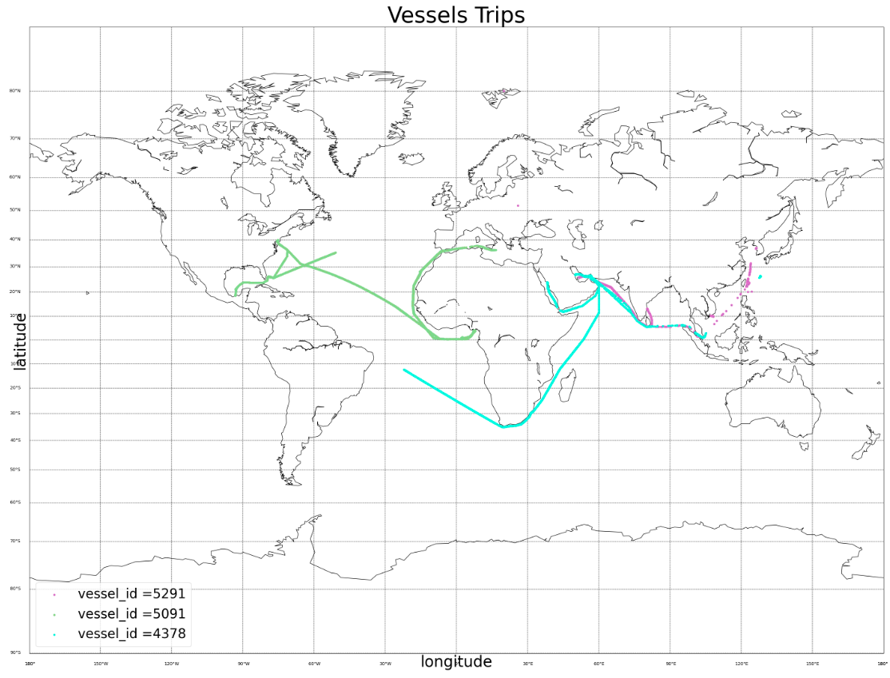

# Vessel positions API 
## Context
A maritime data intelligence company seeks to develop an API capable of validating and consuming vessel positions data and then inserting
them into their systems.

## :dart: Objectives
- Design and develop the API that will insert valid vessel positions in their system.
- Design and develop the front application that will display vessel trips

## Project Structure
- `api_app.py` - main flask app file
- `update_trips.py` - fetch the current vessels positions database and generate an updated chart where each vessel_id has a diffrent colour
- `requirements.txt` - dependencies and libraries
- `templates` - folder that contains all html templates
- `static` - static folder that contains css files and images
- `scripts` - contains populate_db_script.py that populates the database from the given dataset
- `resources` - API resources (GET and POST vessel positions)
- `models` - API models (define VesselPosition model and define its database table)

## Setup
1. Run pip install -r requirements.txt to install required libraries.
2. Instructions to install mpl_toolkits.basemap : https://www.kaggle.com/questions-and-answers/84455
3. Run python api_app.py to run the api and the flask app
4. Run python scripts/populate_db_script.py to populate the database 'vessels_positions' table.
5. Open http://127.0.0.1:5000/ on navigator

6. Form to insert vessel position : click on ADD POSITION : http://127.0.0.1:5000/add_position

7. Display vessels Trips with diffrent colours on a map : click on VESSELS TRIPS http://127.0.0.1:5000/trips/

